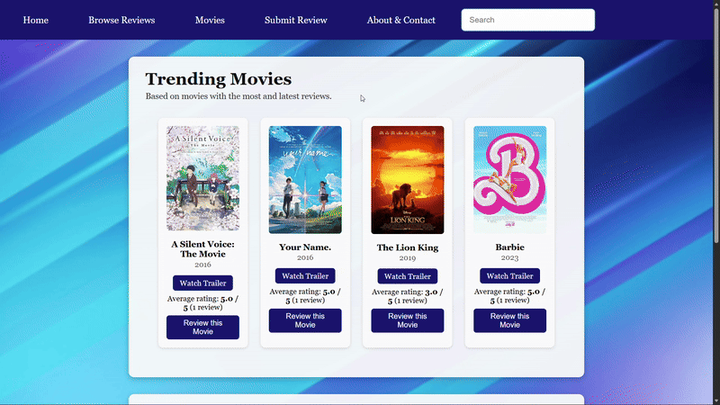

# Flicks & Giggles (Movie Review Website)
A movie review web application built as the final project for the Web Programming course at Ontario Tech University.  
Flicks & Giggles is designed to feel like a light version of a modern streaming platform: users can search for movies, see what others think, and submit their own ratings and reviews through a simple, responsive interface.

## 📦 Technologies

### Frontend
- HTML (multi-page site: `main`, `Movies`, `BrowseReviews`, `SubmitReview`, `About/Contact`)
- CSS (flexbox layout, responsive design, `clamp()` for fluid typography, modal styling)
- JavaScript (`script.js`)

### Data & Backend
- `localStorage` for client-side review storage and calculations
- OMDb API for movie search, posters, and metadata
- PHP 8 (PDO)
- MySQL / MariaDB (`reviewdatabase` with `reviews` table)
- XAMPP / WAMP (Apache + MySQL + PHP stack)


## 💡 Features

Here’s what you can do with **Flicks & Giggles**:

### 🏠 Home Page (`main.html`)
- Landing page that shows:
  - **Trending movies** based on number of reviews and most recent review date.
  - **Latest 5 reviews** across all movies.
- Each trending card includes:
  - Poster (from OMDb)
  - Title + year  
  - Calculated **average rating** from all stored reviews  
  - “Review this Movie” button that opens the submit form with the movie title pre-filled.

### 🎞 Movies Page (`Movies.html`)
- Search bar connected to the **OMDb API**:
  - Uses `fetch()` to send requests and handle JSON responses.
  - Builds a responsive grid of movie cards dynamically.
- Each movie card shows:
  - Poster image (with a placeholder if none is available)
  - Title and release year
  - Average rating + number of reviews (from stored reviews)
  - YouTube trailer search link
  - “Review this Movie” button (prefills `Title (Year)` on the submit page)

### ✍️ Submit Review Page (`SubmitReview.html`)
- Review form with:
  - Movie title (with **autocomplete** using an HTML `<datalist>` populated from OMDb)
  - Your name
  - Rating (1–5)
  - Optional comments
- If the user comes from a movie card, the movie title is **pre-filled** via a URL parameter (`?title=...`).
- When the form is submitted:
  - JavaScript validates basic fields (title not empty, rating between 1–5).
  - A review object is created:
    ```js
    {
      title,
      name,
      rating,
      comments,
      date: new Date().toISOString()
    }
    ```
  - This object is appended to the `reviews` array in `localStorage`.
  - A success message is shown and the form is reset.

### 📚 Browse Reviews Page (JS + PHP versions)

#### `BrowseReviews.html` (localStorage version)
- Reads all reviews from `localStorage`.
- Sorts them from **newest to oldest** by their stored `date`.
- Displays each review in a card with:
  - Movie title
  - Rating (1–5)
  - Reviewer name (or “Anonymous”)
  - Date of review
  - Full review text (or “No comments provided”)

#### `BrowseReviews.php` (database version)
- Uses PHP + PDO to:
  - Connect to the MySQL database.
  - Run a `SELECT` query on the `reviews` table ordered by `created_at DESC`.
- Renders each review row as an HTML card on the page.

### 🛠 Admin Mode (Hidden)

- **Secret admin mode** is activated through the navigation search bar:
  - Typing `iamadmin` and submitting enables admin mode and sets `localStorage.isAdmin = "true"`.
  - Typing `exitadmin` disables admin mode and removes the flag.
- When admin mode is enabled, the Browse Reviews page (JS version) shows extra buttons:
  - **Edit**  
    - Opens an inline form inside the card.  
    - Admin can change the rating (validated to 1–5) and edit the comments.  
    - Saving updates the review in `localStorage` and refreshes the card without a full reload.
  - **Delete**  
    - Prompts for confirmation and then removes the review from `localStorage`.  
    - The list is re-rendered so the deleted review disappears.

### 📞 About & Contact Page (`About.html`)
- Explains the purpose and goals of Flicks & Giggles.
- Reuses the same global navigation and card style to stay consistent with the rest of the site.
- Includes a **“Contact Us” button** that opens a modal overlay with:
  - Phone number
  - Email address
  - Social media handles
- JavaScript shows the modal on button click and hides it when the user clicks on the overlay background.

### 📱 Responsive Design & UI
- Shared **navigation bar** across all pages.
- Background image with light, rounded content cards and subtle shadows.
- Layout built with flexbox and responsive CSS; works on:
  - Desktop
  - Laptop
  - Tablet
  - Mobile
- `clamp()` is used on font sizes to keep text readable on different screen sizes.


## 🧱 System Architecture

The system is split into three main layers:

1. **Client (HTML/CSS + JavaScript)**  
   - Renders all pages and visual components.  
   - Handles DOM events (form submissions, button clicks, search input).  
   - Uses `fetch()` to call the OMDb API and process JSON responses.  
   - Stores and reads reviews from `localStorage`.  
   - Calculates trending movies, average ratings, and latest reviews.

2. **Browser Storage (`localStorage`)**  
   - Holds an array of review objects under the key `"reviews"`.  
   - Used by:
     - Home page (trending + latest reviews)
     - Movies page (average rating per film)
     - Browse Reviews page (JS version)
     - Admin edit/delete tools

3. **PHP + MySQL Backend**  
   - `config.inc.php` defines:
     - `DBHOST`, `DBNAME`, `DBUSER`, `DBPASS`
     - `DBCONNSTRING` for the PDO DSN  
   - `insertReview.php`:
     - Receives POST form data.
     - Validates required fields and ensures `rating` is an integer between 1–5.
     - Inserts a new row into the `reviews` table using a prepared statement.  
   - `BrowseReviews.php`:
     - Opens a PDO connection.
     - Runs:
       ```sql
       SELECT username, movie_title, review_text, rating, created_at
       FROM reviews
       ORDER BY created_at DESC;
       ```
     - Loops through the results and prints each review as a styled HTML card.

This architecture lets the project demonstrate both client-side storage patterns and a basic server-side database pipeline.


## 🗄 Database Structure

The MySQL database is named **`reviewdatabase`** and currently uses a single table:

### `reviews` Table

- `id` – `INT`, primary key, auto-incremented; each review gets a unique ID.  
- `username` – `VARCHAR(100)`; stores the reviewer’s name (nullable for anonymous reviews).  
- `movie_title` – `VARCHAR(255)`; required; title of the movie (often includes the year).  
- `review_text` – `TEXT`; holds the full written review content and supports longer comments.  
- `rating` – `INT UNSIGNED`; numeric rating; the PHP code enforces values between 1 and 5.  
- `created_at` – `DATETIME`; defaults to `CURRENT_TIMESTAMP`, recording when the review was submitted.  

Example aggregate query for statistics:

```sql
SELECT movie_title,
       AVG(rating) AS avg_rating,
       COUNT(*)    AS review_count
FROM reviews
GROUP BY movie_title;
```
Got it 👍 — you want **pure GitHub README Markdown**, **no explanations**, **ready to paste as-is**.
Here it is **clean, complete, and properly formatted**.


## 🚦 Running the Project Locally

To run **Flicks & Giggles** on your local machine:

1. **Clone or download** this repository to your computer.
2. Install **XAMPP** or **WAMP**, then start the following services:

   * **Apache**
   * **MySQL**
3. Copy the project folder into your web root directory, for example:

   ```
   C:\xampp\htdocs\FlicksAndGiggles
   ```
4. Open **phpMyAdmin** at:

   ```
   http://localhost/phpmyadmin
   ```

   * Create a new database named **reviewdatabase**.
   * Import or run the provided SQL script to create the `reviews` table.
5. Open `config.inc.php` and verify the database connection settings:

   ```php
   define("DBHOST", "localhost");
   define("DBNAME", "reviewdatabase");
   define("DBUSER", "root");
   define("DBPASS", "");
   ```

   Update these values if your local MySQL credentials are different.
6. Open your browser and navigate to:

   ```
   http://localhost/FlicksAndGiggles/main.html
   ```

You can now search for movies, submit reviews, browse all reviews, and test the hidden admin edit/delete functionality.


## 📚 What We Learned

This project strengthened both our technical skills and our ability to collaborate effectively as a team.

### 🧠 Web Logic & Data Flow

* Built a multi-page website connected through a shared navigation bar and consistent layout.
* Integrated the OMDb API using `fetch()` and processed JSON responses in JavaScript.
* Implemented logic for calculating average ratings, trending movies, and recent reviews using browser `localStorage`.

### 🔄 Client–Server Integration

* Used `localStorage` for fast, client-side persistence of reviews.
* Implemented a PHP backend using PDO to securely communicate with a MySQL database.
* Practised sending form data from the browser to PHP scripts and inserting it into the database.

### 🗄 Database & SQL

* Designed a focused `reviews` table that maps directly to the review submission form.
* Used SQL aggregate functions such as `AVG()` and `COUNT()` to compute movie statistics like average ratings and review counts.

### 🎨 UI / UX & Frontend Polish

* Designed reusable movie and review cards with a clean, modern layout.
* Used responsive CSS techniques (flexbox, grid, and `clamp()`) to ensure readability on different screen sizes.
* Implemented a modal contact window for better user experience.

### 🤝 Team Collaboration

* Divided responsibilities across frontend design, JavaScript logic, and backend/database work.
* Coordinated code integration and feature implementation as a group.
* Gained experience debugging data flow, admin functionality, and browser vs server storage issues.


## 🍿 Demo

### 🎥 Project Walkthrough

This demo showcases:

* Movie search using the OMDb API
* Submitting and browsing reviews
* Average ratings and trending movies
* Admin edit and delete functionality

<p align="center">
  
</p>

